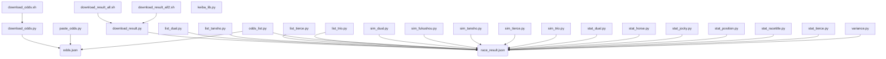

```mermaid
graph TD;
    download_odds.sh --> download_odds.py
    download_odds.py --> J1(odds.json)
    paste_odds.py --> J1
    download_result_all.sh --> download_result.py
    download_result_all2.sh --> download_result.py
    download_result.py --> J2(race_result.json)
    keiba_lib.py
    list_dual.py --> J2
    list_tansho.py --> J2
    list_tierce.py --> J2
    list_trio.py --> J2
    odds_list.py--> J1
    odds_list.py--> J2
    sim_dual.py --> J2
    sim_fukushou.py --> J2
    sim_tansho.py --> J2
    sim_tierce.py --> J2
    sim_trio.py --> J2
    stat_dual.py --> J2
    stat_horse.py --> J2
    stat_jocky.py --> J2
    stat_position.py --> J2
    stat_racetitle.py --> J2
    stat_tierce.py --> J2
    variance.py --> J2
```
